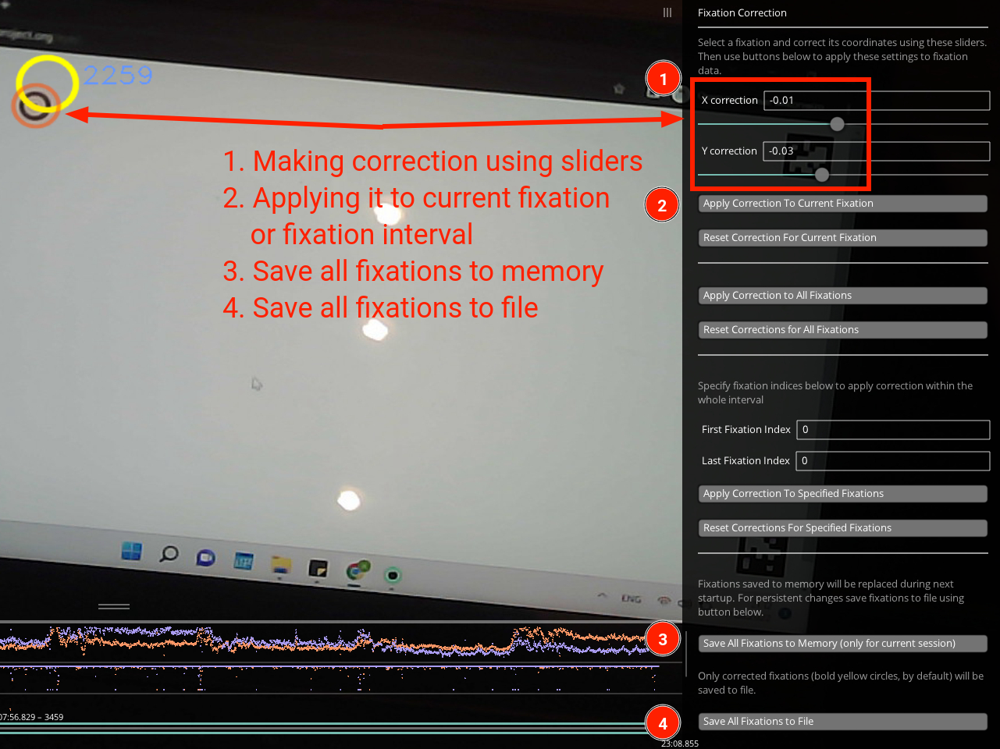

# Fixation Correction Plugin for Pupil Labs Software

This plugin allows you to correct detected fixations and export them to file.

## Installation

Copy `fixation_correction.py` to `pupil_player_settings/plugins` folder which is located in your user's home directory:

* In Linux, `/home/<username>/pupil_player_settings/plugins`.
* In Windows, `C:\Users\<username>\pupil_player_settings\plugins`.

Enable *Fixation Correction* plugin in Plugin Manager.

## Usage

1. Use Fixation Detector to detect fixations.
2. Select a fixation to correct.
3. Use sliders and visualization (semi-transparent orange circle) to make a correction.
4. Apply a correction to current fixation or even fixation interval (specify first and last fixations indices).
5. Save fixations to memory (obligatory step).
6. Save fixations to file.

Note: fixations are saved to `offline_data` folder created by Fixation Detector.
